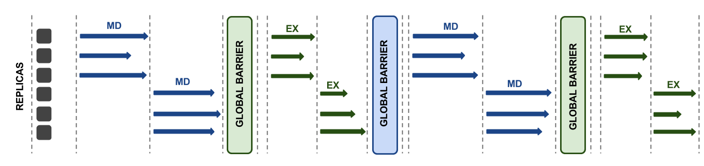
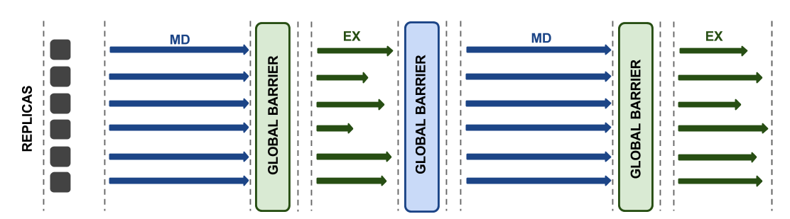
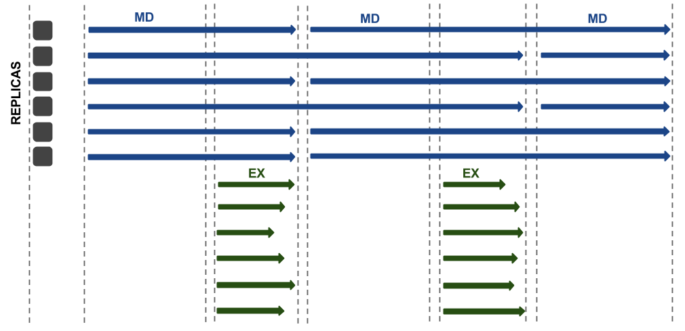

.. _flexibleexecutionmodes:

************************
Flexible execution modes
************************

Execution Strategies specify workload execution details and in particular
the resource management details. These strategies differ in: 

 **1.** MD simulation time definition: fixed period of simulation time (e.g. 2 ps) 
 for all replicas or fixed period of wall clock time (e.g. 2 minutes) for all 
 replicas, meaning that after this time interval elapses all running replicas 
 will be stopped, regardless of how much simulation time was obtained.

 **2.** task submission modes (bulk submission vs sequential submission)

 **3.** task execution modes on remote HPC system (order and level of concurrency)

 **4.** number of Pilots used for a given simulation

 **5.** number of target resources used concurrently for a given simulation

Next we will introduce three Execution Strategies which can be used with Replica 
Exchange Pattern A.

Execution Strategy A1
--------------------- 

Simulation corresponding to Replica Exchange Pattern A, may be executed using 
Execution strategy A1. This strategy differs from a conventional one in number of 
allocated cores on a target resource (bullet point **3.**). In this case number of 
cores is 1/2 of the number of replicas. As a result of this, 
only a half of replicas can propogate MD or Exchange-step concurrently. In this 
execution strategy MD simulation time is defined as a fixed period of simulation 
time (e.g. 2 ps) for all replicas, meaning that replicas which will finish simulation 
earlier will have to wait for other replicas before exchange-step may take place.
This strategy demonstrates advantage of using a task-level parallelism based 
approach. Many MD packages are lacking the capability to use less cores than replicas.     

Execution Strategy A2
---------------------

Execution Strategy A2 differs from Strategy A1 in MD simulation time definition. 
Here MD is specified as a fixed period of wall clock time (e.g. 2 minutes) for 
all replicas. Replicas which will not finish MD-step within this time interval, 
will be stopped. In addition, Strategy A2 differs from Strategy A1 in the number 
of allocated cores. Here number of cores equals to the number of replicas.

Execution Strategy A3
---------------------

Last Execution strategy we will discuss in this section is Execution Strategy A3. 
In this strategy all replicas are run concurrently for a presumably indefinite 
period. At predefined intervals exchanges are performed amongst all (or a subset) 
of replicas on resource using data from checkpoint files. Any replicas that accept
the exchange are reset and then restarted. Since only a small fraction of replicas 
will actually accept this exchange (∼10-30%) the amount of time discarded by the 
exchange is assumed to be minimal. Differences of this strategy from a conventional 
one can be attributed to bullet point **3.**

