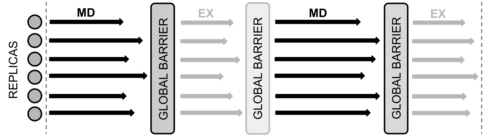
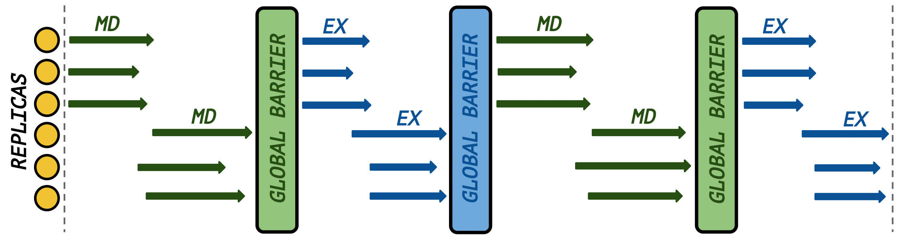

.. _introduction:

************
Introduction
************

What is RepEx ?
===============

RepEx is a new `Replica-Exchange <https://en.wikipedia.org/wiki/Parallel_tempering>`_ Molecular Dynamics (REMD) simulations package 
written in Python. RepEx supports Amber [1] and NAMD [2] as 
Molecular Dynamics engines and can be easily modified to support 
any conventional MD engine. The main motivation behind RepEx is to enable 
efficient and scalable multidimensional REMD simulations on HPC clusters, while separating 
execution details from simulation setup, specific to a given MD engine. 
RepEx relies on a concept of Pilot-System, it is using `Radical Pilot <http://radicalpilot.readthedocs.org/en/latest/>`_
Pilot System for execution of it's workloads. RepEx effectively takes advantage 
of a task-level-parallelism concept to run REMD simulations. RepEx 
is modular, object-oriented code, which is designed to facilitate development of 
extension modules by it's users.

[1] - http://ambermd.org/

[2] - http://www.ks.uiuc.edu/Research/namd/

What can I do with it?
======================

Currently RepEx supports the following exchange types: temperature exchange (T-REMD), umbrella exchange (U-REMD) and salt concentration exchange (S-REMD). It is possible to combine these exchange types into multi-dimentional cases with arbitrary ordering and number of dimensions. This level of flexibility is not attainable by conventional REMD software packages. RepEx easily can be used as a testing platform for new or unexplored REMD methods. Due to relative simplicity of the code, development time is significantly reduced, enabling scientists to focus on their experiments and not on a software engineering task at hand. 

Why should I use it?
====================

While many MD software packages provide implementations of REMD algorithms, a number of implementation challenges exist. Despite the fact that REMD algorithms are very well suited for parallelization, implementing dynamic pairwise communication between replicas is non-trivial. This results in REMD implementations being limited in terms of number of parameters being exchanged and being rigid in terms of synchronization mechanisms. 
The above challenges together with the limitations arising from design specifics contribute to scalability barriers in some REMD software packages. 

The main distinguishing features of RepEx are:

	low barrier for implementation of REMD methods, facilitated by separation of simulation execution details from implementation, specific to current MD engine
   
	functionality to run **multi-dimentional** REMD simulations with arbitrary ordering of dimensions

	functionality to run **synchronous** and **asynchronous** REMD simulations

	**execution flexibility** -- decoupling of the number of replicas from the number of CPU cores

Synchronization flexibility
============================

RepEx supports two synchronization options for REMD simulations:

 **1.** Synchronous REMD simulations

 **2.** Asynchronous REMD simulations

Synchronous REMD
-----------------

Synchronous REMD, corresponds to the conventional way of running simulations, 
where all replicas propagate MD simulations for a fixed period of simulation 
time-steps (e. g. 2 ps) before any of the exchanges happen. The (physical) 
execution time for replicas is not fixed, as all replicas must finish a 
fixed-number of time-steps before the exchange takes place. Only after **all** 
replicas has finished MD simulation, replicas can start exchange parameters. 
As a result, fast replicas have to wait for slow replicas at the **synchronization barrier** .  

Asynchronous REMD
------------------

In asynchronous REMD we don't have a global **synchronization barrier** . This 
means that while some replicas are performing MD simulation, some other replicas 
might be performing an exchange or simply be in indle state. To determine at which 
point replicas must start exchanging parameters (after completing MD simulation) 
we use a parameter called **wait ratio** . Wait ratio specifies the ratio of 
replicas which have already completed MD simulation to the total number of 
replicas. In other words we specify for how many replicas out of **N** replicas 
we have to wait, before we can proceed to exchange of parameters for this subset 
of replicas. Wait ratio is a lower bound: we specify at least how many replicas 
have to finish MD simulation. In practice the number of replicas which will 
proceed to exchange might be larger.

.. image:: ../figures/async-RE-pattern.png
	:alt: pattern-a
	:width: 7.0 in
	:align: center

Execution flexibility
======================

An important feature of RepEx is explicit decoupling of the number of 
replicas from the number of CPU cores. This means that we can use **less** CPU 
cores, than replicas and we also can use **more** CPU cores than replicas for **any** 
type of REMD simulation. Any of the two scenarios are fully controlled by the 
user via ``simulation input file`` and ``resource configuration file``. 

For example, for **6** replicas we can use **3** CPU cores and run each replica 
on a single CPU core (synchronous REMD):    

Here only a half of replicas can propogate MD simulation (or exchange) concurrently.