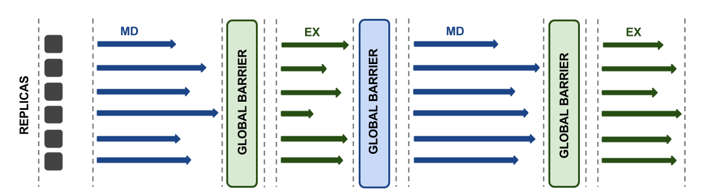

.. _replicaexchangepatterns:

*************************
Replica Exchange Patterns
*************************

A distinctive feature of RepEx is its ability to select a Replica Exchange (RE) Pattern. Replica Exchange Patterns differ in 
synchronization modes between MD and Exchange steps. We define two types of 
Replica Exchange Patterns:

 **1.** Synchronous Replica Exchange Pattern

 **2.** Asynchronous Replica Exchange Pattern

Synchronous Replica Exchange Pattern
------------------------------------

Synchronous RE Pattern, corresponds to the conventional way of running REMD simulations, where all replicas propagate MD for a fixed period of simulation time (e.g. 2 ps) before the exchange phase. The (physical) execution time for replicas is
not fixed, as all replicas must finish a fixed-number of MD-steps before the exchanges take place.

Asynchronous Replica Exchange Pattern
-------------------------------------

In distinction to the Synchronous RE Pattern, the Asynchronous RE Pattern does not have a global synchronization 
barrier. While some replicas are performing an MD-step others might be performing an exchange amongst a subset of replicas. In the current implementation of Asynchronous RE Pattern, the MD phase is defined as a fixed period of simulation time (e.g. 2 ps), but the (physical) execution time for MD phase is fixed (e.g. wall-clock time of 30 secs). When the 
predefined physical execution time elapses, replicas which have finished adequate number of MD-steps transition into the exchange phase. In this pattern there is no synchronization between MD and Exchange phases, thus this pattern can be referred to as asynchronous.

.. image:: ../figures/macro-pattern-b.png
	:alt: pattern-a
	:width: 5.5 in
	:align: center

